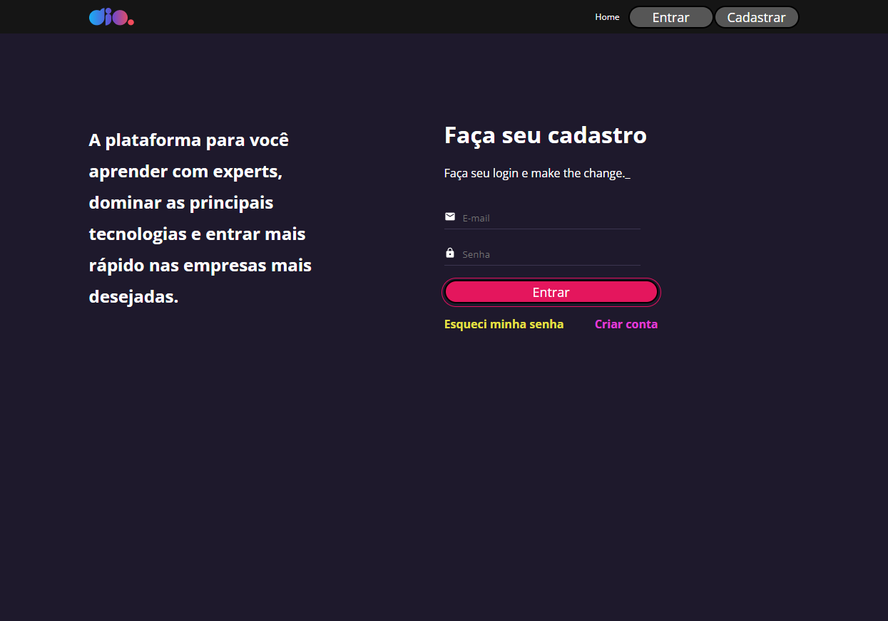
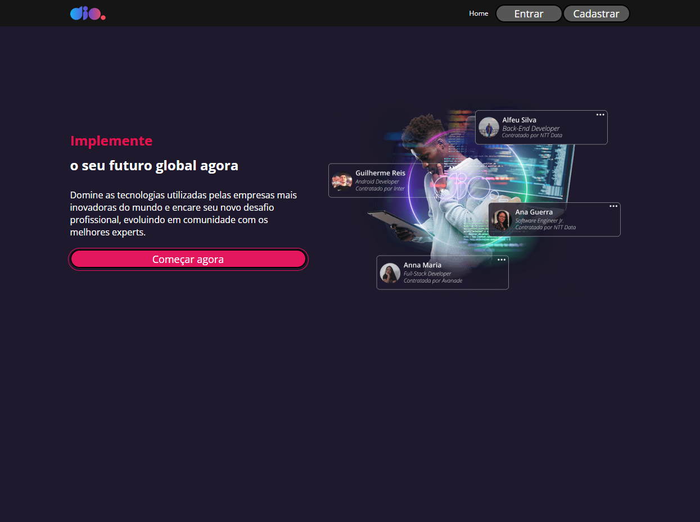
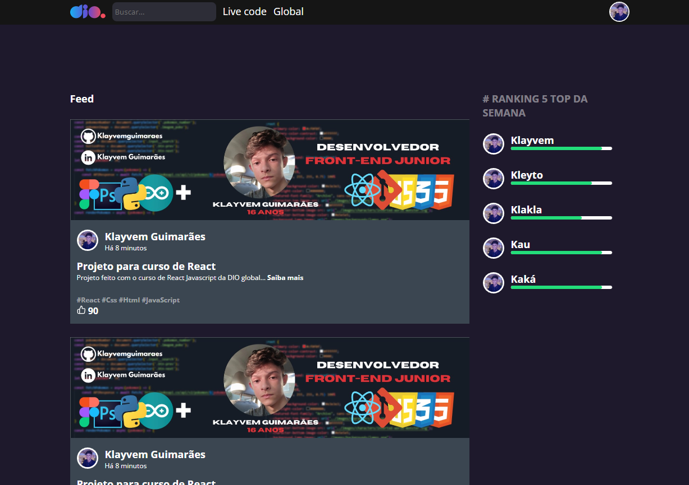

## Telas da plataforma DIO 

    > Tela de Cadastro

 

    > Tela de Login

 

    > Tela de Home 

 

    > Tela de Feed

    > Projeto desenvolvido com inteiramente React-Js onde depois convertemos para Typescript,
    durante todo o módulo de conhecimento e introdução ao React, no Bootcamp-Orange-Tech disponibilizado
    pela DIO em parceria com o banco Inter.

    > Desafio de projeto DIO 

## 🌍 Tecnologias

- REACT-JS
- JAVASCRIPT
- AXIOS ( API )
- STYLED-COMPONENTS

## 📚 Contato

Gmail : klayvemguik@gmail.com  
LinkedIn : https://www.linkedin.com/in/klayvem-guimar%C3%A3es-5a6700248/